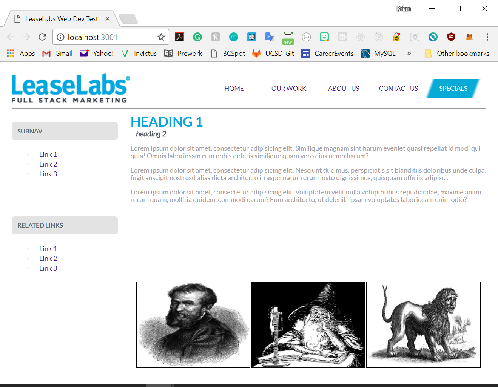

#LeaseLabs/DZAP Front-End Web Developer Test
Completed by Brian Hafner January 22nd, 2018
=============================

# Development Notes

1. I used CSS, Sass, and Gulp exclusively to design this page.
2. I didn't use any front-end libraries, but I used JQuery to load the photos and captions.

# File Structure

1. All the Sass working files are in process/sass
2. style.scss loads the following files:
	a. _normalize.scss -- for browser consistency
	b. _variables.scss -- loads fonts and colors
	c. _grid.scss -- css definitions for working with Grid
	d. _base.scss -- css definitions for base styles
	e. _navigation.scss -- css definitions for navigation
3. Gulp builds the css file and stores it in builds/css
4. The /builds folder also contains the images and js folders.
5. index.html is in the root of /builds

# Running Development Environment and Builds

1. If you clone the LeaseLabs-Web-Dev-Test repo(https://github.com/jbhafner/LeaseLabs-Web-Dev-Test.git), you can run the development environment with "gulp webserver" or "npm run dev".  You can build the css file by running "gulp sass" or "npm run build".  

**Notes**
- I picked the colors by uploading the png copy of the mockup to imagecolorpicker.com to get the HTML/Hex color code.  To zoom in on some finer details, like the nav bar text, I had to use MS Paint to get the RGB value, and then convert to hex using convertingcolors.com.

